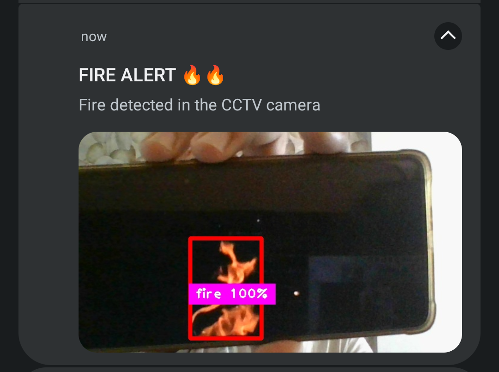

# FireSense

FireSense is a Computer Vision based system to detect fire at an early stage in real-time and alert the user through a
mobile application. It is built by training YOLO model on a dataset consisting 2400 images with and without fire. The system consists of Python program running YOLO model, a Flask server and an Android application to receive instant notification and alert the user by playing siren sound.

### Features

1. Real-time Early Fire Detection
2. Instant Notification
3. Snapshot of detected fire

### Tech Stack used

1. Python
2. YOLOv8
3. Flask
4. Flutter
5. Firebase Cloud Messaging

### Flowchart

### Screenshot

Notification alert on Android device

### Further Development

1. Integrate with the existing CCTV software solution.

